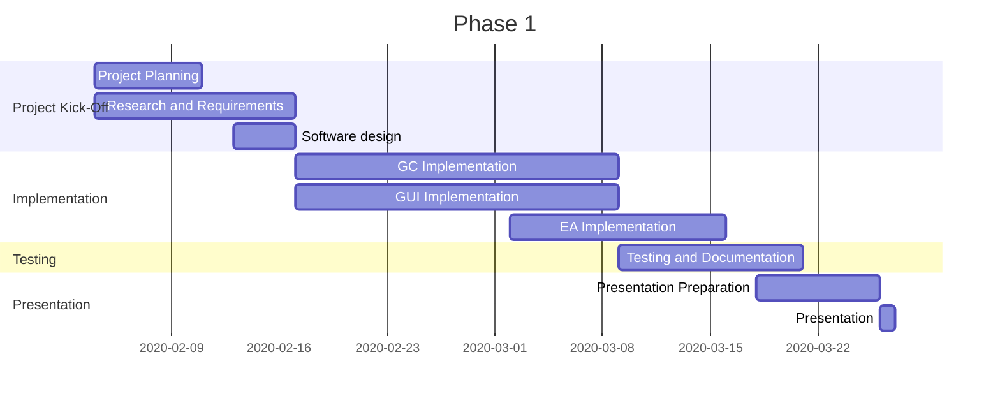

# e8bd358abeeacbb7ccc8c667ccd837e4

This is our very secret project

## Project Planning



| Week | Tasks |
| -------- | -------- |
| **1** | Opening on Tuesday.  Read the project book, try to understand the project. Discuss and create the planning. Do research about the project, such as the implementation of maps, guards and the game controller, and the approach that will be used. Look into the example code which has been uploaded on ELEUM. |
|**06/02**| **11:30**  Meeting with project coordinator. |
| **2** | Discuss what we want from the negotiation meeting. Exchange research results. Plan how the code will be implemented, including the code structure. After the negotiation meeting, continue the research according to the new information.
|**12/02**| **14:00** Meeting with project coordinator.|
| **3** | Start/continue the implementation of the GUI and Game Controller, according to the code planning that was done earlier.|
| **4** | Continue the implementation of the GUI and Game Controller. In case it is finished this week, test and document the code. |
|**04/03**| Meeting with project coordinator.|
| **5** | Carnaval holidays. Continue the implementation of either the GUI and Game Controller, or the exploration agent. Test and document every code that was done. |
| **6** | Finish the implementation. Test and document the finished code. Start with the presentation preparation.|
|**18/03**| Meeting with project coordinator.|
| **7** | Finish presentation preparation, such as the powerpoint. Practice the presentation.  |
|**25/03**| Meeting with project coordinator.|
|**26/03**| Presentation.|


## Getting Started

These instructions will get you a copy of the project up and running on your local machine for development and testing purposes. See deployment for notes on how to deploy the project on a live system.

### Prerequisites

What things you need to install the software and how to install them

```
Give examples
```

### Installing

A step by step series of examples that tell you how to get a development env running

Say what the step will be

```
Give the example
```

And repeat

```
until finished
```

End with an example of getting some data out of the system or using it for a little demo

## Running the tests

Explain how to run the automated tests for this system

### And coding style tests

Explain what these tests test and why

```
Give an example
```

## Deployment

Add additional notes about how to deploy this on a live system

## Built With

* [JavaFX](https://openjfx.io/) - The graphic framework used

## Authors

* **Merlin Koehler** - [MerlinKoehler](https://github.com/MerlinKoehler)

See also the list of [contributors](https://github.com/MerlinKoehler/e8bd358abeeacbb7ccc8c667ccd837e4/contributors) who participated in this project.

## Acknowledgments

